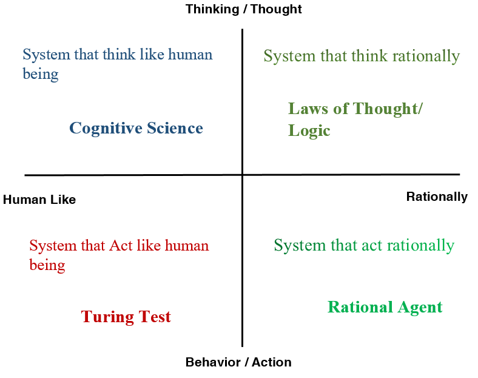

# Introducción

[Transparencias - Introducción.pdf](./Introducción.pdf)

### AIMA (aka. la Biblia de la IA)

[AIMA: Descargar en PDF](https://www.google.com/url?sa=t&rct=j&q=&esrc=s&source=web&cd=1&ved=2ahUKEwiivYTEs7DdAhUPWxoKHQ_-CVoQFjAAegQICxAC&url=https%3A%2F%2Ffaculty.psau.edu.sa%2Ffiledownload%2Fdoc-7-pdf-a154ffbcec538a4161a406abf62f5b76-original.pdf&usg=AOvVaw0i7pLrlBs9LMW296xeV6b0)

## ¿Qué es la IA?

> Mera introducción de la asignatura y saber qué es la inteligencia artificial.

La imagen de abajo es un resumen de las diversas interpretaciones que se le pueden dar según el objetivo deseado.

